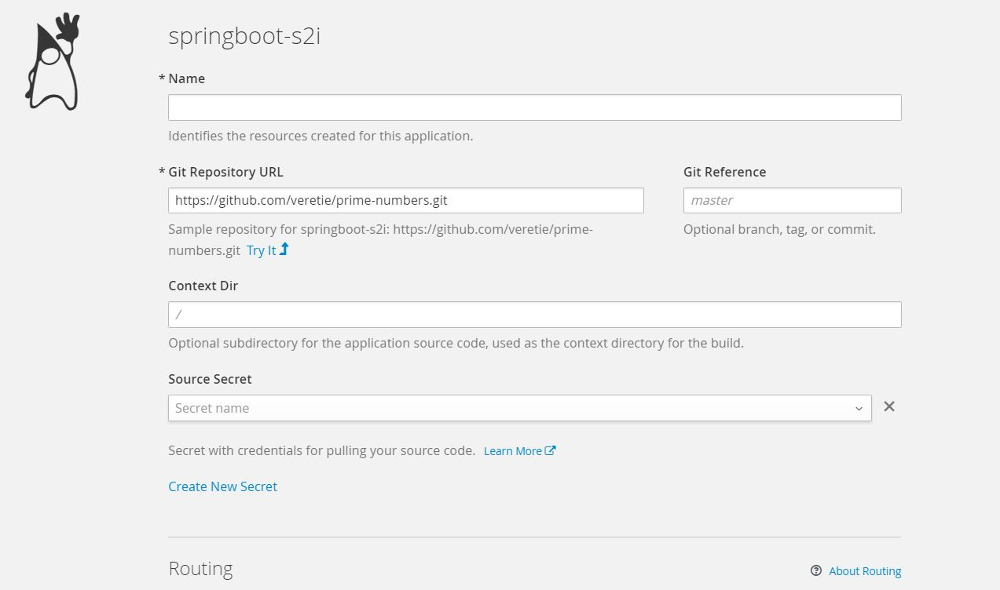

# Java S2I (source-to-image) for springboot apps

### Overview
Project holds scripts and configuration to build ```springboot-s2i``` builder image for springboot source-to-image applications.
Use ```create-all-ose-objects.bat``` script to set up (or update project) automatically. Script will load base ```base-centos7```
image, will create build config referencing Dockerfile from this repository and will create ```springboot-s2i``` image
stream that will hold the builder image.

### SpringBoot S2I
```springboot-s2i``` builder image contains:
 - Oracle JDK 1.8.0_131 x64 bit, set ```JVM_ARGS``` environment variable to add extra arguments to ```java``` process
 - Jolokia (disabled by default, to enable set environment variable ```JOLOKIA_ENABLED=true```).
   Add ```8778``` port named ```jolokia``` that will render ```Open Java Console``` jolokia link in openshift GUI container view.
 - Maven 3.3.9

#### Remote debug application built with Java S2I
 Remote debugging is disabled by default, to enable set environment variable ```DEBUG=true``` which will start listening to opened ```5005``` port in your application container.
 You can use port forward on your local application ```oc port-forward <POD_NAME> 5005:5005``` and then attach your IDE to ```127.0.0.1:5005``` to debug application.

### GUI

After builder image installation ```springboot-s2i``` will appear under ```Java``` images panel where it can be customised:



### How it works

 Openshift will checkout GIT source from provided repository, copy this to builder image where
 maven clean package command will be executed to create uber jar.
 Jar will be copied to application image's ```/opt/app-root/``` directory.
 When running application image, ```java``` command referencing that jar will be constructed
 based on provided envronment variables where debuging, jolokia, etc. can be enabled.
